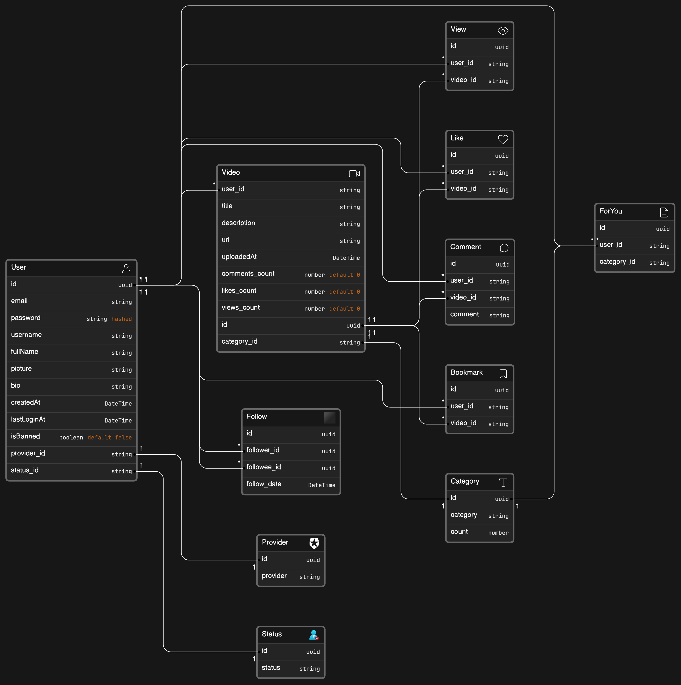

# LearnTok - Educational TikTok App

LearnTok is an educational TikTok app designed for learning purposes. The app allows users to share short educational videos and engage with content in a fun and interactive way.

## Technologies Used

- Node.js
- Express.js
- PostgreSQL
- NEXT JS (for web frontend)
- React Native (for mobile frontend)

## Getting Started with front end server

First change directory to client directory

```bash
cd client
```

Second, run the development server:

```bash
npm install
# or
yarn install
# or
pnpm install
```

## Getting Started with back end server

First change directory to backend

```bash
cd backend
```

Second, run the development server:

```bash
npm install
# or
yarn install
# or
pnpm install
```

## Run Backend Server

```bash
npm start
```

## Run Client (frontend) Server

```bash
npm run dev
```

## Database Screenshot


